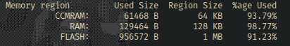

This is a poorly made telemetry software for the STM32F407VxT (The x doesn't
mean anything as this won't work on models with less than 1 MB flash) based
boards such as the STM32F407G-DISC1. I haven't a clue if this is compilable
given just this repo, STM32CUBEMX, and CMake but the intention is that it
should be compilable. If this is not the case right now, it will eventually be
the case.

Oh, and, the project is not yet complete

### Third Party

- [{fmt}](https://github.com/fmtlib/fmt) for formatting
- [cjvaughter](https://github.com/cjvaughter)'s
  [fork](https://github.com/cjvaughter/scnlib/tree/sandbox)
  of [scnlib](https://github.com/eliaskosunen/scnlib) for parsing
- My [fork](https://github.com/xor-shift/P256-Cortex-M4)
  of [Emill](https://github.com/Emill)'s
  [Cortex-M4 P256 library](https://github.com/Emill/P256-Cortex-M4)
  for message signatures
- My [LibStuff](https://github.com/xor-shift/LibStuff) for stuff™
- ST Microelectronics' HAL for obvious purposes
- FreeRTOS, again, for obvious reasons

### How to Compile and Run

// TODO: fill in this section

### Help, I am Running Out of Flash Space and RAM

